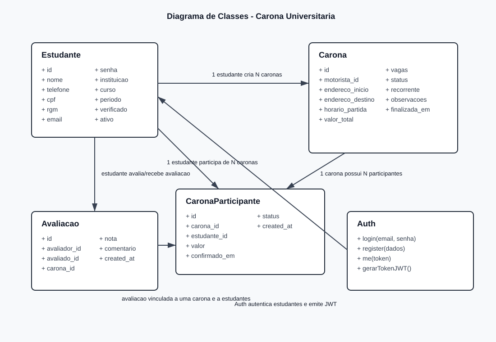
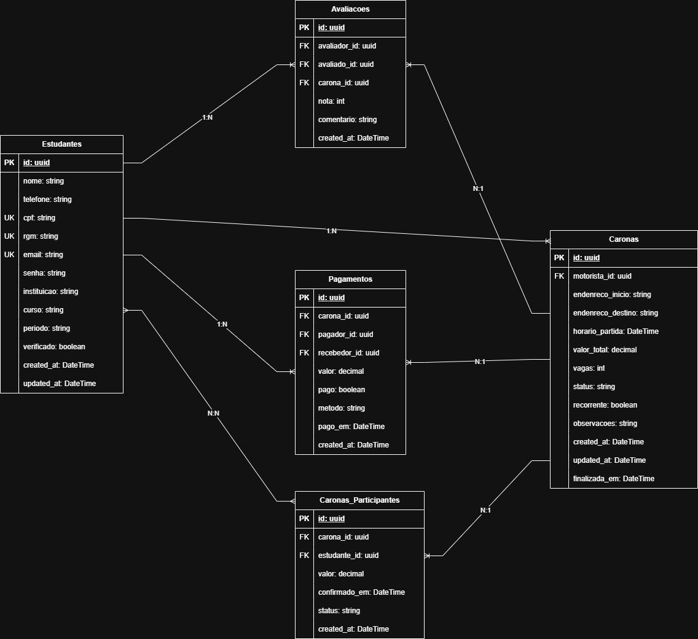

# Atividade 4 - Arquitetura de Software

## Arquitetura Geral

O projeto **Carona Universitaria Inteligente** adota uma arquitetura de API **REST** com organizacao em camadas inspirada no padrao **MVC**.

A aplicacao backend e responsavel por expor endpoints HTTP para cadastro, autenticacao, gerenciamento de caronas, participantes e avaliacoes. O fluxo principal da arquitetura e:

1. O cliente envia uma requisicao HTTP para uma rota da API.
2. A camada de `routes` direciona a requisicao para o controller correto.
3. O `controller` recebe os dados, chama a regra de negocio e retorna a resposta.
4. A camada de `services` concentra a comunicacao com o banco e as operacoes da entidade.
5. A camada de `models` representa as tabelas principais do banco de dados.
6. O banco **MySQL** armazena estudantes, caronas, participantes e avaliacoes.

Essa separacao facilita manutencao, testes, evolucao das funcionalidades e organizacao do codigo.

---

## Estrutura do Projeto

```text
carona-universitaria-backend/
|-- documentacao/
|   |-- arquivos/
|   |-- imagens/
|   |-- entrega2.md
|   |-- entrega3.md
|   |-- entrega4.md
|   `-- entrega5.md
|-- src/
|   |-- controller/
|   |   |-- avaliacoes.js
|   |   |-- CaronasController.js
|   |   |-- carona_participantes.js
|   |   `-- estudantes.js
|   |-- database/
|   |   `-- connection.js
|   |-- middleware/
|   |   `-- auth.js
|   |-- models/
|   |   |-- avaliacoes.js
|   |   |-- caronas.js
|   |   |-- carona_participantes.js
|   |   `-- estudantes.js
|   |-- routes/
|   |   |-- auth.js
|   |   |-- avaliacoes.js
|   |   |-- caronas.js
|   |   |-- carona_participantes.js
|   |   `-- estudantes.js
|   |-- services/
|   |   |-- avaliacoes.js
|   |   |-- carona_participantes.js
|   |   `-- estudantes.js
|   `-- index.js
|-- package.json
`-- README.md
```

### Responsabilidades das Pastas

- `controller/`: recebe requisicoes e respostas da API.
- `services/`: executa regras e operacoes das entidades.
- `models/`: representa as entidades do banco.
- `routes/`: define os endpoints HTTP.
- `database/`: configura a conexao com o MySQL.
- `middleware/`: armazena regras intermediarias, como autenticacao JWT.

---

## Tecnologias Utilizadas

| Tecnologia | Uso no projeto |
|---|---|
| Node.js | Ambiente de execucao do backend |
| Express | Criacao do servidor HTTP e das rotas REST |
| MySQL | Banco de dados relacional da aplicacao |
| mysql2 | Driver de conexao entre Node.js e MySQL |
| JSON Web Token | Autenticacao dos usuarios |
| express-jwt | Middleware para proteger rotas |
| cors | Permite requisicoes de outros dominios |
| dotenv | Configuracao por variaveis de ambiente |
| nodemon | Reinicio automatico do servidor em desenvolvimento |
| tsx / TypeScript | Suporte ao fluxo de desenvolvimento configurado no projeto |
| Postman | Testes manuais dos endpoints |

---

## Endpoints da API

### Autenticacao

| Metodo | Rota | Descricao |
|---|---|---|
| POST | `/auth/login` | Realiza login e retorna um token JWT |
| POST | `/auth/register` | Cadastra um estudante pela rota de autenticacao |
| GET | `/auth/me` | Retorna os dados do estudante autenticado |

### Estudantes

| Metodo | Rota | Descricao |
|---|---|---|
| GET | `/estudantes` | Lista todos os estudantes |
| GET | `/estudantes/:id` | Busca um estudante pelo id |
| POST | `/estudantes` | Cadastra um estudante |
| PUT | `/estudantes/:id` | Atualiza dados de um estudante |
| DELETE | `/estudantes/:id` | Remove um estudante |

### Caronas

| Metodo | Rota | Descricao |
|---|---|---|
| GET | `/caronas` | Lista todas as caronas |
| GET | `/caronas/:id` | Busca uma carona pelo id |
| POST | `/caronas` | Cadastra uma nova carona |
| PUT | `/caronas/:id` | Atualiza uma carona |
| DELETE | `/caronas/:id` | Remove uma carona |

### Participantes de Caronas

| Metodo | Rota | Descricao |
|---|---|---|
| GET | `/carona-participantes` | Lista todos os participantes de caronas |
| GET | `/carona-participantes/:id` | Busca uma participacao pelo id |
| GET | `/carona-participantes/carona/:carona_id` | Lista participantes de uma carona |
| GET | `/carona-participantes/estudante/:estudante_id` | Lista participacoes de um estudante |
| POST | `/carona-participantes` | Cadastra um estudante em uma carona |
| PUT | `/carona-participantes/:id` | Atualiza uma participacao |
| DELETE | `/carona-participantes/:id` | Remove uma participacao |

### Avaliacoes

| Metodo | Rota | Descricao |
|---|---|---|
| GET | `/avaliacoes` | Lista todas as avaliacoes |
| GET | `/avaliacoes/:id` | Busca uma avaliacao pelo id |
| POST | `/avaliacoes` | Cadastra uma avaliacao |
| PUT | `/avaliacoes/:id` | Atualiza uma avaliacao |
| DELETE | `/avaliacoes/:id` | Remove uma avaliacao |

---

## Autenticacao

A autenticacao e feita com **JWT (JSON Web Token)**.

O usuario envia `email` e `senha` para a rota `POST /auth/login`. O backend consulta a tabela `estudantes`; quando as credenciais sao validas, a API gera um token JWT contendo dados basicos do usuario, como `id`, `nome` e `email`.

Esse token deve ser enviado nas requisicoes protegidas no header:

```text
Authorization: Bearer <token>
```

O middleware `protegerRota`, definido em `src/middleware/auth.js`, valida o token usando o algoritmo `HS256`. Caso o token esteja ausente ou invalido, a API bloqueia o acesso.

Rotas de cadastro, alteracao, remocao e consultas sensiveis utilizam essa protecao para restringir o acesso a usuarios autenticados.

---

## Diagrama de Classes



O diagrama representa as classes principais do sistema:

- `Estudante`: usuario da plataforma, podendo atuar como motorista ou passageiro.
- `Carona`: viagem criada por um estudante motorista.
- `CaronaParticipante`: associacao entre estudantes e caronas.
- `Avaliacao`: avaliacao feita entre usuarios apos a carona.
- `Auth`: servico de autenticacao responsavel por login, cadastro, consulta do usuario autenticado e geracao do token.

---

## Prototipos de Tela

O backend nao possui telas proprias, pois esta entrega trata da API. Como referencia visual do produto, existe a landing page do frontend citada na documentacao do projeto:

- Repositorio frontend: `https://github.com/Renn4nn/carona-universitaria-frontend`
- Deploy da landing page: `https://carona-universitaria-landing-page.vercel.app/`

Tambem ha um diagrama de banco ja documentado na entrega 3:



---

## Consideracoes

A arquitetura escolhida prioriza simplicidade, organizacao e facilidade de evolucao. A API REST com Express atende bem ao escopo do MVP, permitindo que o frontend consuma dados por endpoints claros e padronizados.

A separacao entre rotas, controllers, services, models, middleware e database reduz o acoplamento do codigo e facilita a manutencao. O uso de MySQL e adequado por se tratar de um sistema com entidades relacionais, como estudantes, caronas, participantes e avaliacoes.

A autenticacao com JWT garante uma base de seguranca para proteger operacoes sensiveis. Como evolucoes futuras, o projeto pode melhorar a criptografia das senhas, ampliar validacoes, adicionar logs de auditoria, tratar permissoes por perfil e incluir testes automatizados.
